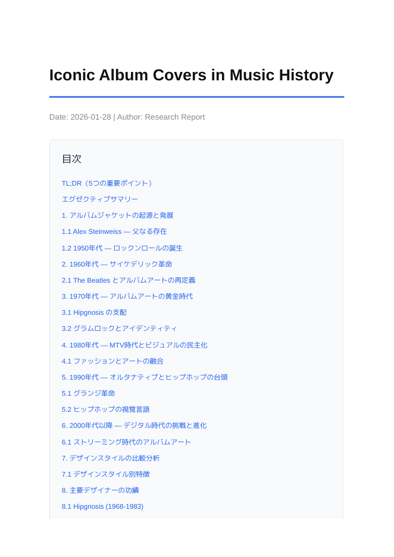
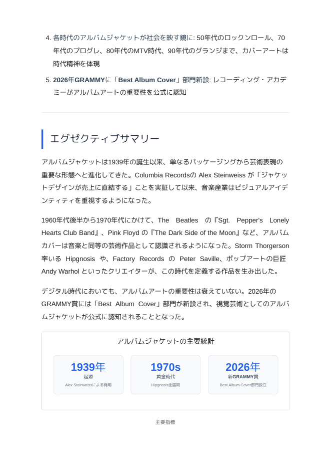
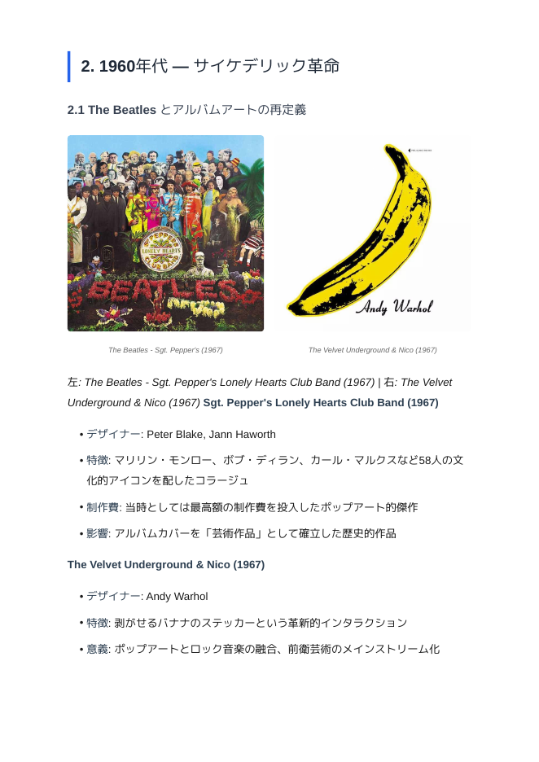
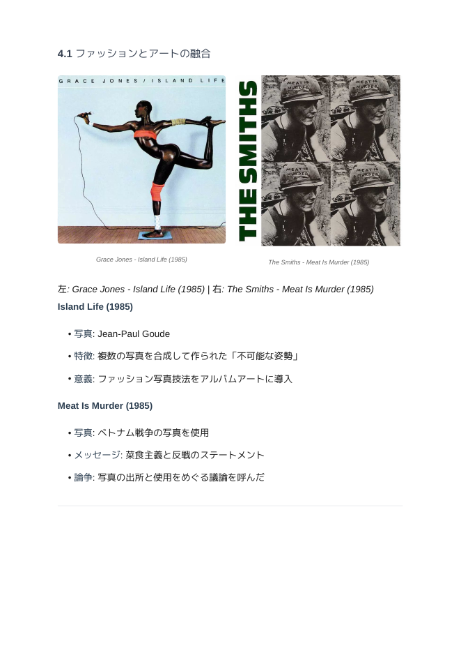

# Research Report Generator

Claude Code用のリサーチレポート生成スキル。  
Webリサーチ → 図表生成 → PDF出力を自動化。

## なぜこのスキルが必要か？

Claude Codeに「〜について調べて」とお願いしたとき、こんな課題がある：

| 課題 | このスキルでの解決 |
|------|------------------|
| 🔍 Web参照量が少なくなりがち | 最低5つ以上の一次ソースを参照 |
| 🖼️ 画像が含まれない | Web画像を自動取得・最適化 |
| 📄 PDFの体裁が汚くなりがち | プロ品質のスタイリング |

**Deep Researchほどの情報量はないが、過不足のない現実的なリサーチ結果が得られる。**

人間のリサーチャーが半日かけてまとめるような成果物を、数分で生成。

---

## アウトプットイメージ

### 入力プロンプト

```
音楽史の偉大なアルバムジャケットについてリサーチレポートを作成して。
各時代の代表的なジャケットと、そのデザインの特徴・影響を解説。
画像付きで。
```

### 生成されるPDF

<p align="center">
  
  
  
  
</p>

---

## 機能

- 🔍 **Webリサーチ**: 複数ソースから情報収集、一次ソース優先
- 📊 **図表生成**: 棒グラフ、円グラフ、統計カード、比較表
- 🖼️ **画像取得**: Web画像のダウンロード・最適化・選別
- 📄 **PDF出力**: プロフェッショナルなレイアウト

---

## 必要環境

- Python 3.10+
- Claude Code
- Ralph Loop プラグイン（推奨）

---

## セットアップ

```bash
cd research-report
python -m venv .venv
source .venv/bin/activate
pip install weasyprint pillow requests
```

---

## 使い方

### Claude Codeから直接実行

```
skills/research-report/SKILL.md を読んで、[トピック]についてレポートを作成して
```

### Ralph Loopで実行（推奨）

```
/ralph-loop:ralph-loop "
skills/research-report/SKILL.md を読んで、[トピック]についてレポートを作成する
" --completion-promise "SKILL_COMPLETE" --max-iterations 15
```

---

## スクリプト

| スクリプト | 説明 |
|-----------|------|
| `scripts/generate_pdf.py` | Markdown → PDF変換 |
| `scripts/create_diagram.py` | SVG図表生成（棒グラフ、円グラフ等） |
| `scripts/download_images.py` | Web画像ダウンロード・最適化 |

---

## 図表タイプ

```bash
# 棒グラフ
python scripts/create_diagram.py --type bar \
  --title "タイトル" \
  --data '[{"label": "A", "value": 75}]' \
  --output chart.svg

# 円グラフ
python scripts/create_diagram.py --type pie \
  --title "シェア" \
  --data '[{"label": "A", "value": 60}]' \
  --output pie.svg

# 統計カード
python scripts/create_diagram.py --type stats \
  --title "主要指標" \
  --data '[{"label": "ROI", "value": "9,900%"}]' \
  --output stats.svg

# 比較表
python scripts/create_diagram.py --type comparison \
  --title "比較" \
  --data '[{"name": "製品A", "price": "$100"}]' \
  --output table.svg
```

---

## ライセンス

MIT
